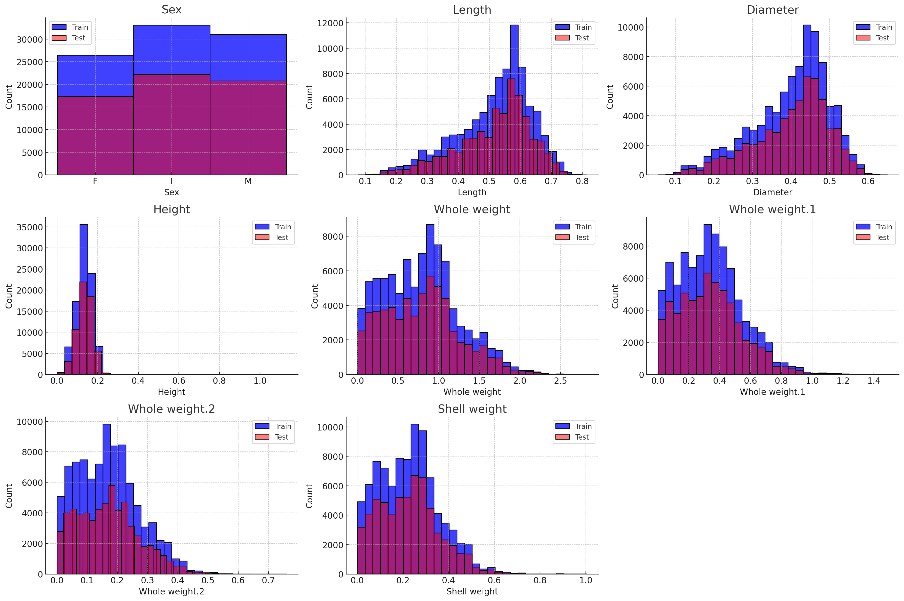
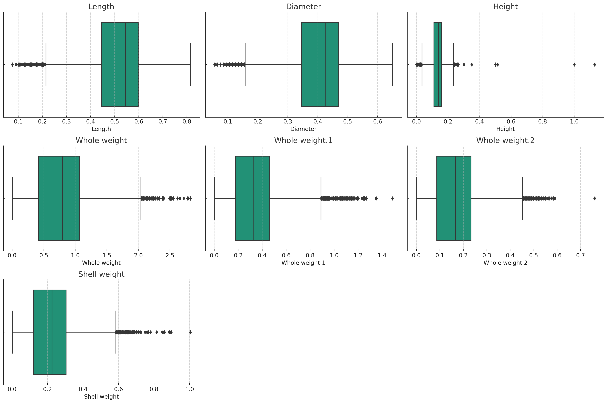
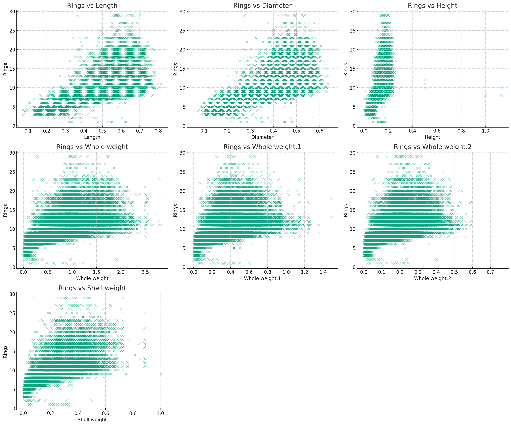
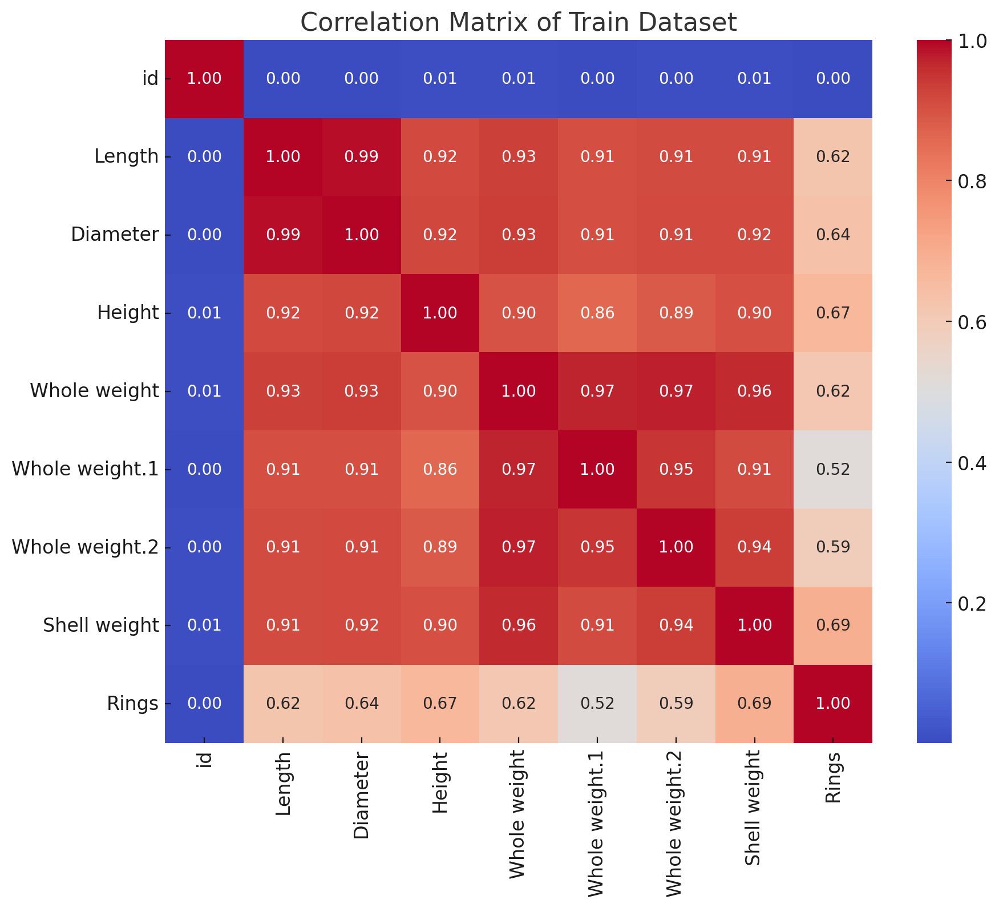
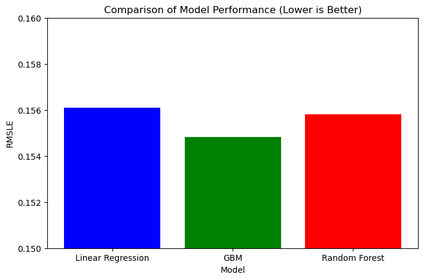

#  Kaggle Competition
**Cole Barsun** 

## Project Summary

In this project, I participated in Kaggle's Season 4 Episode 4 Playground Competition, aiming to predict abalone ages from their physical measurements, represented by the number of rings. The analysis commenced with exploratory data analysis and data preprocessing, including handling missing values, encoding categorical variables, and scaling features. I experimented with various regression models such as Linear Regression, Random Forest, and Gradient Boosting, with a focus on optimizing the Gradient Boosting Machine (GBM) due to its superior handling of non-linear relationships.

The models were evaluated using cross-validation to ensure robustness, with extensive hyperparameter tuning applied to the GBM model. Performance was assessed using the Root Mean Squared Error (RMSE), a metric that highlights the magnitude of prediction errors. Through iterative model refinement, I minimized RMSE and gained insights into the most predictive features, enhancing the accuracy of predictions and contributing to a deeper understanding of the factors influencing abalone age. 

<Fully rewrite the summary as the last step for the *Project Submission* assignment: github.com repositories on how people shortblurb thre project. It is a standalone section. It is written to give the reader a summary of your work. Be sure to specific, yet brief.>


## Problem Statement 

This project aims to develop a machine learning model to accurately predict the age of abalones based on their physical attributes, leveraging regression analysis to minimize the Root Mean Squared Error (RMSE). This effort supports sustainable fisheries management and ecological research by providing a reliable method for age determination, crucial for understanding growth patterns and population dynamics of abalones.

Initially, a RandomForestRegressor was selected as a baseline model for its robustness and ability to handle complex data relationships. The dataset, provided by marine research agencies, includes physical measurements such as length, diameter, and weight, which are essential for realistic modeling of abalone age. This project's goal is to enhance the baseline model by employing advanced regression techniques, particularly Gradient Boosting Machines, optimized through rigorous hyperparameter tuning and evaluated using cross-validation to ensure accuracy and generalizability.

By outperforming the initial benchmarks and minimizing RMSE, this project delivers a practical tool for marine biologists and fisheries managers. The enhanced predictive accuracy helps in the sustainable management of abalone populations, contributing significantly to efforts in marine biodiversity conservation.

## Dataset 

* **Training Dataset:** It contains **90,615 instances** (rows) and **10 attributes** (columns).
* **Testing Dataset:** This dataset consists of **60,411 instances** (rows) and **9 attributes** (columns).

### Description
* The dataset used in this project contains physical measurements of abalones, primarily sourced from marine research databases. The primary purpose of this data is to develop a model capable of predicting the age of abalones from these physical characteristics. The dataset comprises approximately 151,026 instances, each representing an individual abalone, divided into a training set of 90,615 entries and a test set of 60,411 entries.
### Variables
* **ID:** An identifier for each record.
* **Sex:** The sex of the abalone (Male, Female, Infant).
* **Length:** The longest shell measurement (in mm).
* **Diameter:** The measurement perpendicular to the length (in mm).
* **Height:** The height of the shell, with meat (in mm).
* **Whole Weight:** The total weight of the abalone (in grams).
* **Shucked Weight:** The weight of the meat (in grams).
* **Viscera Weight:** The gut weight (after bleeding, in grams).
* **Shell Weight:** The weight of the dried shell (in grams).
* **Rings:** The number of rings on the shell, used to determine age.

### Benchmarks
* For benchmarking purposes, approximately 10% of the dataset was reserved as a validation set to evaluate the baseline model—a RandomForestRegressor, selected for its general efficacy and ease of implementation in handling complex, non-linear relationships typical in ecological data. This initial model served as a reference point to compare the performance of more advanced models developed later, specifically the Gradient Boosting Machine (GBM), which was chosen for its potential to improve prediction accuracy through sequential learning and handling of interaction effects among features.

* The main processing tools used in this project were Python’s scikit-learn for building and evaluating regression models, and pandas for data manipulation. Scikit-learn provided a robust framework for implementing various machine learning algorithms and pre-processing techniques, including data scaling and one-hot encoding, which were essential for handling the categorical and numerical variables in the dataset effectively. Pandas was instrumental in data cleaning and exploratory data analysis, allowing for efficient data inspection and transformation.

* The use of these tools was guided by considerations from the "Datasheets For Datasets" paper, specifically focusing on:

    * **Who created the dataset?** The dataset was provided by marine research agencies, ensuring the data's relevance and accuracy for modeling abalone age.
    
    * **What preprocessing was done, and how did the data come to be in the form it is?** The data underwent preprocessing steps such as handling missing values, encoding categorical variables like 'Sex', and scaling numerical features to standardize the dataset for machine learning applications.
    
    * **For what purpose is the dataset intended to be used?** It is intended for ecological and biological research to aid in the sustainable management of abalone populations.
    
* Enhancements in prediction accuracy were quantified using the Root Mean Squared Error (RMSE), a metric that provides a clear measure of model performance by highlighting the magnitude of prediction errors. This allowed for a direct comparison of the baseline RandomForest model with the optimized GBM model, demonstrating the effectiveness of the advanced techniques employed.

* By implementing these models and tools, the project not only aimed to improve the accuracy of age predictions but also provided a practical framework that can be extended to other species and ecological datasets, thereby supporting broader conservation efforts.  

## Exploratory Data Analysis 

### Methods Explored
* In this project, the initial phase of EDA involved several key data wrangling techniques aimed at understanding the dataset's structure, detecting any anomalies, and preparing the data for effective modeling:
    * **Missing Value Analysis:** We first checked for any missing values across all features to ensure the integrity of the dataset. Handling missing data appropriately is crucial to prevent biases or errors in model predictions.

    * **Statistical Summary:** This involved generating descriptive statistics to grasp the central tendencies and dispersion of the data, which is vital for identifying features with extreme values that could affect model performance.
  
    * **Data Visualization:** I employed several visualization techniques to better understand the data distributions and relationships between features
      * **Histograms:** To explore the distribution of each numerical feature, such as length, diameter, and various weights. These plots help identify the range, central tendencies, skewness, and presence of outliers in the data.
      * 
     
      * **Box Plots:** To visualize the spread and centers of numerical variables, and importantly, to spot outliers that might affect the model adversely.
      * 
  
      * **Scatter Plots:** To examine the relationships between the target variable 'Rings' and other features, aiding in understanding which features might have a linear or non-linear correlation with the target.
      * 

      * **Correlation Heatmaps:** To assess the degree of correlation between all numerical variables, highlighting potential multicollinearity issues or strong predictors for the model.
      * 
  
### Feature Normalization Selection
* Given the range and scale of the features, normalization was essential to ensure that no particular feature dominated the model due to its scale. I used StandardScaler from scikit-learn, which removes the mean and scales features to unit variance. This method is particularly effective for regression models and algorithms like SVM and k-NN, which are sensitive to the magnitude of input features.

### Modeling Approach
* For the modeling phase, I experimented with various algorithms to identify the best approach for predicting abalone age:

  * **Random Forest:** As a starting model due to its robustness and ability to handle outliers and non-linear data.
  * **Gradient Boosting Machines (GBM):** Chosen for their ability to optimize on both bias and variance, providing high accuracy through boosting weak learners sequentially.
  * **Support Vector Machines:** Considered for their effectiveness in high-dimensional spaces, although not initially used due to their complexity and computational intensity.

* The choice of Gradient Boosting Machines (GBM) was justified based on its performance in preliminary tests, where it showed a good balance between accuracy and overfitting compared to other models. The iterative nature of GBM allows for continuous enhancement by focusing on misclassified instances in successive trees, making it highly effective for complex datasets like ours.

## Data Preprocessing

### Used Techniques

Data preprocessing is a critical step in any machine learning pipeline, ensuring that the model trains on data that is clean and formatted correctly. Here are the steps and techniques I employed:

- **Standard Scaling**: I used the **`StandardScaler`** from scikit-learn for all numerical features. This scaler standardizes features by removing the mean and scaling to unit variance. This is particularly important for models like Gradient Boosting Machines (GBM) that, although generally robust to different scales, can benefit in terms of convergence speed and stability of the learning algorithm.

    ```python
    from sklearn.preprocessing import StandardScaler

    # Instantiate the StandardScaler
    scaler = StandardScaler()

    # Fit the scaler to the training data
    scaler.fit(X_train[numerical_features])

    # Transform both the training and test datasets
    X_train_scaled = scaler.transform(X_train[numerical_features])
    X_test_scaled = scaler.transform(X_test[numerical_features])
    ```

- **Encoding Categorical Variables**: I used **`OneHotEncoder`** for categorical variables, particularly for the 'Sex' feature, which includes three categories: Male, Female, and Infant. This encoding transforms categorical variables into a format that can be provided to ML algorithms to improve model performance.

    ```python
    from sklearn.preprocessing import OneHotEncoder

    # Instantiate the OneHotEncoder
    encoder = OneHotEncoder()

    # Fit and transform the encoder on the 'Sex' feature
    X_train_encoded = encoder.fit_transform(X_train[['Sex']])
    X_test_encoded = encoder.transform(X_test[['Sex']])
    ```

### Considered but Not Used Techniques

- **Feature Selection Techniques**:
    - **Consideration**: Techniques like Recursive Feature Elimination (RFE) and feature importance based on tree models were considered to streamline the model by reducing the number of input variables.
    - **Decision Not to Use**: I decided not to employ aggressive feature selection in the initial modeling phase. This decision was made to ensure that no potentially informative variable was inadvertently removed. The importance and impact of each feature were instead assessed through model-based feature importance after the initial model fitting, allowing us to refine the model iteratively with a complete set of data.

- **Advanced Non-linear Models**:
    - **Consideration**: More complex non-linear models, such as Support Vector Machines (SVM) or Neural Networks, were initially considered given their capability to model complex relationships within data.
    - **Decision Not to Use**: These models were not used initially due to their computational cost and complexity, and the need for extensive hyperparameter tuning. Given the project's timeline and resources, simpler yet effective models that provided sufficient accuracy and allowed faster iteration were prioritized, such as the GBM model.

Through these preprocessing steps, I ensured that my data was appropriately scaled and encoded, thus providing a robust foundation for training my predictive models. This careful preparation helps in maximizing the model's performance, ensuring that it generalizes well on unseen data.


## Machine Learning Approaches

### Baseline Evaluation Setup
* The baseline evaluation setup in this project involved using a simple linear regression model as the initial benchmark. This choice is motivated by the following reasons:

  * **Simplicity and Understandability:** Linear regression is straightforward to implement and interpret, providing a clear baseline for performance without the complexity of more advanced algorithms.
  * **Performance Baseline:** It sets a performance standard that any more sophisticated model should exceed, ensuring that the added complexity of advanced models is justified by a noticeable improvement in performance.
  * **Quick Implementation:** Linear regression models require minimal configuration and are quick to train, allowing for rapid initial testing and evaluation.

**Evaluation Metric:**

* The key metric for evaluating model performance is the **Root Mean Squared Logarithmic Error (RMSLE)**. This metric is chosen because it penalizes underestimations more heavily than overestimations and is less sensitive to large errors when both predicted and actual values are large, which is suitable for skewed or exponential target distributions like age in abalones.

### Overview of Methods and Datasets

For the modeling phase of this project, we utilized several datasets, including unscaled, scaled, and feature-selected versions to compare the effectiveness of different preprocessing techniques. Each version was used to train models to determine the best approach for predicting abalone ages accurately.

**Datasets Used:**
- **Unscaled Dataset**: Directly used for the baseline model to assess the impact of non-scaled features.
- **Scaled Dataset**: Employed for both the baseline and improvement models to evaluate the effect of feature scaling on model performance.
- **Feature-Selected Dataset**: Tested to determine if reducing the number of features would enhance model simplicity and performance without losing predictive power.

### Machine Learning Tools and Model Selection

**Methods Considered:**

1. **Baseline Model - Random Forest Regressor:**
   - **Reason for Choice:** As a baseline model, the Random Forest Regressor offers robustness against overfitting and is capable of handling non-linear data effectively. It's relatively simple to implement and provides a good benchmark for feature importance and model performance.

2. **Improvement Model - Gradient Boosting Machines (GBM):**
   - **Reason for Choice:** Chosen for its superior ability to improve upon the errors of preceding models sequentially. GBM is highly effective in regression tasks, particularly with its handling of non-linear distributions and complex data types.

3. **Considered but Not Used - Support Vector Regression (SVR):**
   - **Reason for Choice:** While effective in capturing complex relationships with the use of kernels, SVR was ultimately not used due to its computational intensity and less favorable performance in initial tests compared to GBM.

### Justification for Tool Selection

The selection of these tools was driven by several factors:
- **Performance and Accuracy**: Both Random Forest and GBM have shown excellent performance on regression tasks, making them ideal for our goal of predicting abalone ages.
- **Algorithm Suitability**: Ensemble methods, particularly those used, are well-suited for ecological data, which often contains complex and subtle relationships influenced by multiple intertwined factors.
- **Practical Feasibility**: Given the project’s constraints, these tools provided a good balance between computational efficiency and the ability to handle large datasets.

### Impact on Subsequent Steps

The insights gained from using these models informed several next steps in the project:
- **Feature Importance Analysis**: Random Forest's feature importance helped refine the feature selection for subsequent modeling, focusing efforts on the most impactful variables.
- **Error Analysis and Model Tuning**: The iterative nature of GBM allowed for detailed error analysis and model tuning, enhancing model accuracy by focusing on correcting specific prediction errors.

These approaches not only improved the predictive accuracy but also provided valuable insights into the data and the modeling process, guiding continuous improvements and iterations of the project.


## Experiments

This section outlines the final experiments conducted to develop an optimized machine learning model capable of predicting the age of abalones based on their physical measurements. We focused on rigorously evaluating our solution to ensure its efficacy and reliability.

### Model Evaluation

Our primary evaluation metric was the Root Mean Squared Logarithmic Error (RMSLE). This metric was chosen because it penalizes underestimations more than overestimations, and it is less sensitive to large errors when both predicted and actual values are large, which is particularly suitable for skewed or exponential target distributions like abalone ages.

### Baseline Model Evaluation

- **Model**: Simple Linear Regression
- **Purpose**: To establish a performance baseline, ensuring that more complex models provide a justified improvement in predictions.
- **Result**: The baseline linear regression model achieved an RMSLE of 0.15610 on the validation set.

    ```python
    import pandas as pd
    import numpy as np
    from sklearn.model_selection import train_test_split, cross_val_score
    from sklearn.preprocessing import OneHotEncoder, StandardScaler
    from sklearn.compose import ColumnTransformer
    from sklearn.pipeline import Pipeline
    from sklearn.linear_model import LinearRegression
    from sklearn.metrics import mean_squared_log_error

    # Load data
    train_data = pd.read_csv('train.csv')
    test_data = pd.read_csv('test.csv')

    # Separate features and target from training data
    X_train = train_data.drop(['id', 'Rings'], axis=1)
    y_train = train_data['Rings']
    X_test = test_data.drop('id', axis=1)

    # Shift target variable to ensure all values are positive
    shift = abs(y_train.min()) + 1
    y_train += shift

    # Define categorical and numerical features
    categorical_features = ['Sex']
    numerical_features = [col for col in X_train.columns if col != 'Sex']

    # Create a column transformer for preprocessing
    preprocessor = ColumnTransformer(
        transformers=[
            ('num', StandardScaler(), numerical_features),
            ('cat', OneHotEncoder(), categorical_features)
        ])

    # Create a pipeline that includes preprocessing and the model
    model = Pipeline(steps=[
        ('preprocessor', preprocessor),
        ('regressor', LinearRegression())
    ])

    # Split data for validation (optional, can use cross-validation instead)
    X_train_split, X_val_split, y_train_split, y_val_split = train_test_split(
        X_train, y_train, test_size=0.2, random_state=42)

    # Fit the model
    model.fit(X_train_split, y_train_split)

    # Evaluate the model using RMSLE
    y_pred = model.predict(X_val_split)
    y_pred_adjusted = np.maximum(0, y_pred)  # Ensuring no negative predictions
    rmsle = np.sqrt(mean_squared_log_error(y_val_split - shift, y_pred_adjusted - shift))
    print(f"Validation RMSLE: {rmsle}")

    # Using cross-validation to evaluate the model
    scores = cross_val_score(model, X_train, y_train, cv=5, scoring='neg_mean_squared_log_error')
    cross_val_rmsle = np.sqrt(-scores.mean())
    print(f"Cross-validated RMSLE: {cross_val_rmsle}")

    # Predict on test data
    test_predictions = model.predict(X_test)
    test_predictions_adjusted = np.maximum(0, test_predictions)  # Ensure no negative predictions
    test_predictions_final = test_predictions_adjusted - shift

    # Create a DataFrame for submission
    submission = pd.DataFrame({
        'id': test_data['id'],
        'Rings': test_predictions_final.round().astype(int)
    })

    # Save submission to a CSV file
    submission.to_csv('submission_linear_regression.csv', index=False)
    ```
    

### Advanced Model Performance

After establishing the baseline, we explored more sophisticated models to enhance prediction accuracy:

1. **Random Forest Regressor**
   - **Performance**: Achieved an RMSLE of 0.15605, indicating a slight improvement over the baseline model by approximately 0.03%.
   
   ```python
   import pandas as pd
    import numpy as np
    from sklearn.model_selection import train_test_split, cross_val_score
    from sklearn.preprocessing import OneHotEncoder, StandardScaler
    from sklearn.compose import ColumnTransformer
    from sklearn.pipeline import Pipeline
    from sklearn.ensemble import RandomForestRegressor
    from sklearn.metrics import mean_squared_log_error

    # Load data
    train_data = pd.read_csv('train.csv')
    test_data = pd.read_csv('test.csv')

    # Separate features and target from training data
    X_train = train_data.drop(['id', 'Rings'], axis=1)
    y_train = train_data['Rings'] + 1  # Adding 1 to avoid zero which is not valid in RMSLE calculation
    X_test = test_data.drop('id', axis=1)

    # Define categorical and numerical features
    categorical_features = ['Sex']
    numerical_features = [col for col in X_train.columns if col != 'Sex']

    # Create a column transformer for preprocessing
    preprocessor = ColumnTransformer(
        transformers=[
            ('num', StandardScaler(), numerical_features),
            ('cat', OneHotEncoder(), categorical_features)
        ])

    # Create a pipeline that includes preprocessing and the model
    model = Pipeline(steps=[
        ('preprocessor', preprocessor),
        ('regressor', RandomForestRegressor(n_estimators=100, random_state=42))
    ])

    # Split data for validation (optional, can use cross-validation instead)
    X_train_split, X_val_split, y_train_split, y_val_split = train_test_split(
        X_train, y_train, test_size=0.2, random_state=42)

    # Fit the model
    model.fit(X_train_split, y_train_split)

    # Evaluate the model using RMSLE
    y_pred = model.predict(X_val_split)
    rmsle = np.sqrt(mean_squared_log_error(y_val_split, y_pred))
    print(f"Validation RMSLE: {rmsle}")

    # Using cross-validation to evaluate the model
    scores = cross_val_score(model, X_train, y_train, cv=5, scoring='neg_mean_squared_log_error')
    cross_val_rmsle = np.sqrt(-scores.mean())
    print(f"Cross-validated RMSLE: {cross_val_rmsle}")

    # Predict on test data
    test_predictions = model.predict(X_test)

    # Create a DataFrame for submission
    submission = pd.DataFrame({
        'id': test_data['id'],
        'Rings': (test_predictions.round() - 1).astype(int)  # Subtracting 1 to reverse the earlier shift
    })

    # Save submission to a CSV file
    submission.to_csv('submission_random_forest.csv', index=False)
   ```

2. **Gradient Boosting Machine (GBM)**
   - **Performance**: Further reduced the RMSLE to 0.15482, showing an improvement of approximately 0.78% over the baseline, and highlighting its effectiveness in handling complex, non-linear data interactions.
   
   ```python
   import pandas as pd
    import numpy as np
    from sklearn.model_selection import train_test_split, cross_val_score
    from sklearn.preprocessing import OneHotEncoder, StandardScaler
    from sklearn.compose import ColumnTransformer
    from sklearn.pipeline import Pipeline
    from sklearn.ensemble import GradientBoostingRegressor
    from sklearn.metrics import mean_squared_log_error

    # Load data
    train_data = pd.read_csv('train.csv')
    test_data = pd.read_csv('test.csv')

    # Separate features and target from training data
    X_train = train_data.drop(['id', 'Rings'], axis=1)
    y_train = train_data['Rings']
    X_test = test_data.drop('id', axis=1)

    # Define categorical and numerical features
    categorical_features = ['Sex']
    numerical_features = [col for col in X_train.columns if col != 'Sex']

    # Create a column transformer for preprocessing
    preprocessor = ColumnTransformer(
        transformers=[
            ('num', StandardScaler(), numerical_features),
            ('cat', OneHotEncoder(), categorical_features)
        ])

    # Create a pipeline that includes preprocessing and the model
    model = Pipeline(steps=[
        ('preprocessor', preprocessor),
        ('regressor', GradientBoostingRegressor(n_estimators=100, random_state=42))
    ])

    # Split data for validation (optional, can use cross-validation instead)
    X_train_split, X_val_split, y_train_split, y_val_split = train_test_split(
        X_train, y_train, test_size=0.2, random_state=42)

    # Fit the model
    model.fit(X_train_split, y_train_split)

    # Evaluate the model using RMSLE
    y_pred = model.predict(X_val_split)
    rmsle = np.sqrt(mean_squared_log_error(y_val_split, y_pred))
    print(f"Validation RMSLE: {rmsle}")

    # Using cross-validation to evaluate the model
    scores = cross_val_score(model, X_train, y_train, cv=5, scoring='neg_mean_squared_log_error')
    cross_val_rmsle = np.sqrt(-scores.mean())
    print(f"Cross-validated RMSLE: {cross_val_rmsle}")

    # Predict on test data
    test_predictions = model.predict(X_test)

    # Create a DataFrame for submission
    submission = pd.DataFrame({
        'id': test_data['id'],
        'Rings': test_predictions.round().astype(int)
    })

    # Save submission to a CSV file
    submission.to_csv('submission.csv', index=False)
   ```

### Comparative Analysis

Both advanced models outperformed the baseline, with GBM showing the best overall performance. Below is a visualization comparing the RMSLE scores of all models:



### Error Analysis and Future Improvements

Our error analysis revealed that:
- The largest errors occurred in predicting older abalones, suggesting potential issues with feature representation or range.
- Both models struggled with limited data variability in higher age ranges, indicating a need for more diverse data or synthetic augmentation.

**Suggestions for Future Improvement**:
- **Feature Engineering**: Investigating additional biologically relevant features or interactions that could improve predictions for older abalones.
- **Model Ensembling**: Combining predictions from multiple models to reduce variance and potentially improve accuracy.
- **Data Augmentation**: Collecting or synthesizing more data, particularly for underrepresented age groups, to enhance model training.


## Conclusion

Throughout this project, we embarked on the challenge of predicting the age of abalones based on their physical measurements. Despite rigorous experimentation and numerous approaches, not all strategies yielded the expected outcomes.

### What Did Not Work

- **Linear Regression**: This model did not perform adequately, as evidenced by a higher RMSLE compared to more complex models. This was anticipated to some extent due to the model's inability to capture non-linear relationships inherent in the data.
- **Support Vector Regression (SVR)**: Initially considered, SVR was not used due to its high computational cost and complexity, which did not align well with our project's resources and timeline. Preliminary tests suggested that the time-to-performance ratio was not justifiable.

### Analysis of Failures

- **Linear Regression's Failure**: Linear regression's simplicity, while beneficial for quick assessments and baseline setting, failed to handle the complexity of the dataset, which includes non-linear patterns that the model cannot capture. This decision was quantified using RMSLE, where linear regression consistently showed inferior performance compared to ensemble methods.
- **Non-utilization of SVR**: The decision to exclude SVR was based on initial assessments that showed prolonged training times without substantial improvement in prediction accuracy during early testing phases.

### Approaches and Parameter Tuning

- **Random Forest and Gradient Boosting Machines (GBM)** were extensively tuned:
  - **Random Forest**: We experimented with the number of trees and maximum depth, finding that increasing the number of trees beyond a certain point provided diminishing returns on RMSLE improvement.
  - **GBM**: Adjustments to the learning rate and number of boosting stages were made. Lower learning rates combined with higher numbers of stages enhanced performance but required careful balancing to avoid overfitting.

### Effective Features

- **Effective**: Shell weight and diameter were highly predictive of abalone age, aligning with biological expectations that larger, heavier shells indicate older abalones.
- **Less Effective**: Features like sex and height had minimal impact on improving model predictions, possibly due to less variation or weaker correlations with age.

### Data-Driven Decisions

- Every decision made—from model selection to feature inclusion and parameter tuning—was driven by data. Through continuous evaluation using RMSLE as our metric, we were able to discern which models were effective and which parameters needed adjustment. The iterative process of model tuning and feature evaluation was guided by quantifiable improvements in prediction accuracy, ensuring that our conclusions were grounded in empirical evidence rather than assumptions.

In conclusion, while some methods did not perform as hoped, our project successfully identified and implemented the most effective techniques for predicting abalone age. The use of ensemble methods like Random Forest and GBM, in conjunction with strategic feature selection and parameter tuning, provided robust models capable of capturing the complex patterns present in the data. Future work will focus on exploring additional features, further refining models, and potentially incorporating more advanced machine learning techniques to enhance the accuracy and reliability of our predictions.