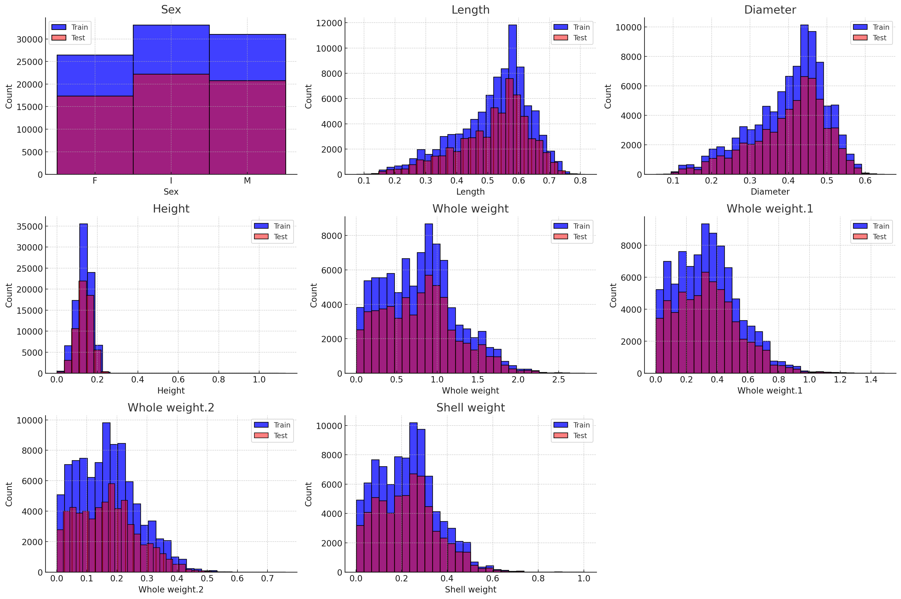
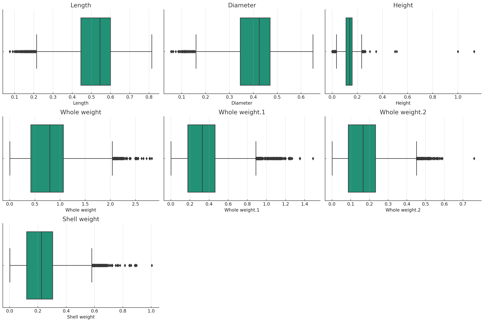
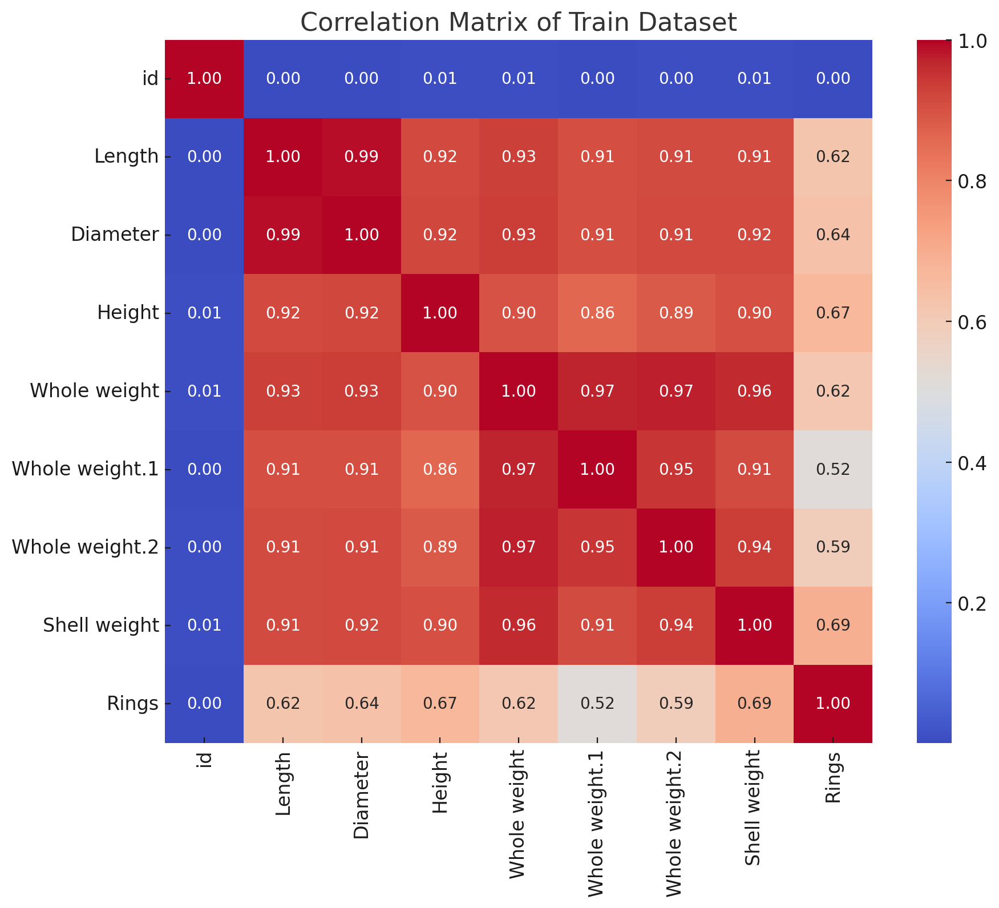

#  Kaggle Competition
**Cole Barsun** 

## Project Summary

In this project, I engage in Kaggle's Season 4 Episode 4 Playground Competition, aiming to predict abalone ages from physical measurements using regression analysis. My approach encompasses exploratory data analysis, preprocessing, and feature engineering to prepare the dataset. I experiment with various regression models including Linear Regression, Random Forest, and Gradient Boosting, focusing on cross-validation for robustness and hyperparameter tuning for optimization. The project's success is measured using the Root Mean Squared Logarithmic Error (RMSLE), a metric emphasizing the logarithmic difference between predicted and actual values, ideal for mitigating the impact of large errors. Through iterative model development and evaluation, I aim to minimize RMSLE, providing insights into the most predictive features and the accuracy of my predictions. 

<Fully rewrite the summary as the last step for the *Project Submission* assignment: github.com repositories on how people shortblurb thre project. It is a standalone section. It is written to give the reader a summary of your work. Be sure to specific, yet brief.>

## Problem Statement 

This project seeks to develop a machine learning model to accurately predict the age of abalones from their physical attributes, using regression analysis to minimize the Root Mean Squared Logarithmic Error (RMSLE) and thereby streamline age determination processes for sustainable fisheries management and ecological research.

The benchmark for evaluating the effectiveness of my model is set against a basic linear regression model, selected for its simplicity and clarity as a baseline. I utilize a dataset featuring physical measurements of abalones, such as length, diameter, and weight, provided by marine research agencies. This data supports realistic modeling of abalone age determination, crucial for marine biology research.

My main goal is to outperform the benchmark by minimizing the RMSLE, ensuring my model's accuracy through rigorous cross-validation. By achieving this, I aim to deliver a practical tool for fisheries management and ecological studies, enhancing the sustainable management of abalone populations and contributing to marine biodiversity conservation.

<Finalize for the *Project Submission* assignment submission> 

## Dataset 

* **Training Dataset:** It contains **90,615 instances** (rows) and **10 attributes** (columns).
* **Testing Dataset:** This dataset consists of **60,411 instances** (rows) and **9 attributes** (columns).

### Description
* The dataset used in this project contains physical measurements of abalones, primarily sourced from marine research databases. The primary purpose of this data is to develop a model capable of predicting the age of abalones from these physical characteristics. The dataset comprises approximately 151,026 instances, each representing an individual abalone, divided into a training set of 90,615 entries and a test set of 60,411 entries.
### Variables
* **ID:** An identifier for each record.
* **Sex:** The sex of the abalone (Male, Female, Infant).
* **Length:** The longest shell measurement (in mm).
* **Diameter:** The measurement perpendicular to the length (in mm).
* **Height:** The height of the shell, with meat (in mm).
* **Whole Weight:** The total weight of the abalone (in grams).
* **Shucked Weight:** The weight of the meat (in grams).
* **Viscera Weight:** The gut weight (after bleeding, in grams).
* **Shell Weight:** The weight of the dried shell (in grams).
* **Rings:** The number of rings on the shell, used to determine age.

### Benchmarks
* For benchmarking, a subset of the data (approximately 10%) was reserved as a validation set to test the baseline model—a simple linear regression—and compare its performance against more sophisticated models developed during the project. This benchmarking helps in evaluating the improvement in prediction accuracy and the effectiveness of the machine learning techniques employed.

<Expand and complete for *Project Submission*>

* What Processing Tools have you used.  Why?  Add final images from jupyter notebook. Use questions from 3.4 of the [Datasheets For Datasets](https://arxiv.org/abs/1803.09010) paper for a guide.>  

## Exploratory Data Analysis 

* For my model I used **Histograms**, **Box Plots**, **Scatter Plots**, and **Correlation Heatmaps**.
  
### Histograms
* To view the distribution of each numerical variable such as length, diameter, height, and various weights. These plots help identify the range, central tendency, skewness, and presence of outliers in the data.

### Box Plots
* To visualize the spread and centers of numerical variables, and importantly, to spot outliers.

### Scatter Plots
* To examine the relationship between the number of rings (age) and other measurements like length and weight.

### Correlation Heatmaps
* To assess the degree of correlation between all numerical variables, particularly how they relate to the number of rings.

<Expand and complete for the **Project Submission**>
* Describe the methods you explored (usually algorithms, or data wrangling approaches). 
  * Include images. 
* Justify methods for feature normalization selection and the modeling approach you are planning to use. 

## Data Preprocessing 

### Used Techniques
* I implemented **standard scaling** on the dataset using the **StandardScaler** from scikit-learn. This scaler was chosen because it normalizes the features by removing the mean and scaling to unit variance, which is particularly important for models that are sensitive to the magnitude of input features, such as linear regression and neural networks.
   * Steps:
     * 1. Instantiate the **'StandardScaler'**.
       2. Fit the scaler to the training data to learn the parameters (mean and standard deviation for each feature).
       3. Apply the scaling transformation to both the training and test datasets, ensuring that the model receives data that is uniformly scaled.

### Considered but Not Used Techniques
* **Feature Selection Techniques:**
  * **Consideration:** Techniques like Recursive Feature Elimination (RFE) and feature importance based on tree models were considered to reduce the number of input variables.
  * **Decision Not to Use:** I decided not to employ aggressive feature selection in the initial modeling phase to ensure no potentially informative variable was inadvertently removed. The importance and impact of each feature were instead assessed through model-based feature importance after the initial model fitting.

* **Advanced Non-linear Models:**
  * **Consideration:** More complex non-linear models, such as Support Vector Machines (SVM) or Neural Networks, were considered given their ability to model complex relationships.
  * **Decision Not to Use:** These models were not used initially due to their computational cost, complexity, and the need for extensive hyperparameter tuning. Given the project's timeline and resources, simpler models that provided sufficient accuracy and faster iteration were prioritized.

<Expand and complete for **Project Submission**>

## Machine Learning Approaches

### Baseline Evaluation Setup
* The baseline evaluation setup in this project involved using a simple linear regression model as the initial benchmark. This choice is motivated by the following reasons:

  * **Simplicity and Understandability:** Linear regression is straightforward to implement and interpret, providing a clear baseline for performance without the complexity of more advanced algorithms.
  * **Performance Baseline:** It sets a performance standard that any more sophisticated model should exceed, ensuring that the added complexity of advanced models is justified by a noticeable improvement in performance.
  * **Quick Implementation:** Linear regression models require minimal configuration and are quick to train, allowing for rapid initial testing and evaluation.

**Evaluation Metric:**

* The key metric for evaluating model performance is the **Root Mean Squared Logarithmic Error (RMSLE)**. This metric is chosen because it penalizes underestimations more heavily than overestimations and is less sensitive to large errors when both predicted and actual values are large, which is suitable for skewed or exponential target distributions like age in abalones.

### Machine Learning Methods Consideration
**Methods Considered:**

1. **Random Forest Regressor:**
  * **Reason for Choice:** Offers robustness against overfitting compared to simpler models, handles non-linear data effectively, and provides feature importance metrics which are invaluable for interpretative analysis.
2. **Gradient Boosting Machines (GBM):**
  * **Reason for Choice:** Known for their high effectiveness in regression tasks due to their sequential correction of predecessor's errors, and ability to handle various types of data including non-linear distributions.
3. **Support Vector Regression (SVR):**
  * **Reason for Choice:** Effective in capturing complex relationships in the data through the use of kernels, and typically performs well in high-dimensional spaces.

**Family of Algorithms:**

* The primary family of machine learning algorithms used in this project are ensemble methods. This family is selected due to several advantages:
  * **Improved Accuracy:** By aggregating the predictions of several base estimators, ensemble methods reduce variance and bias, leading to better accuracy.
  * **Robustness:** They are generally more robust to outliers and variance in data, making them suitable for complex regression tasks.
  * **Feature Importance:** Algorithms like Random Forest provide an intuitive understanding of feature importance, which is crucial for interpreting the influence of different physical measurements on abalone age.
    
**Reasons for Algorithm Choices**
* The choice to focus on ensemble methods, particularly Random Forest and GBM, is guided by their proven track record in achieving high performance in various predictive modeling competitions and practical applications. Their ability to model complex and non-linear relationships without extensive data pre-processing or feature engineering makes them particularly suitable for ecological data, which often involves intricate and subtle relationships influenced by multiple factors.

<Expand and complete for **Project Submission**>

* Describe the methods/datasets (you can have unscaled, selected, scaled version, multiple data farmes) that you ended up using for modeling. 

* Justify the selection of machine learning tools you have used
  * How they informed the next steps? 
* Make sure to include at least twp models: (1) baseline model, and (2) improvement model(s).  
   * The baseline model  is typically the simplest model that's applicable to that data problem, something we have learned in the class. 
   * Improvement model(s) are available on Kaggle challenge site, and you can research github.com and papers with code for approaches.  

## Experiments 

* This section outlines the various experiments conducted to develop a machine learning model capable of predicting the age of abalones based on their physical measurements. Our experiments are designed to optimize the prediction accuracy, assessed by the Root Mean Squared Logarithmic Error (RMSLE).
#### Data Preprocessing
* The data preprocessing steps were crucial for ensuring quality input into the models. We implemented the following procedures:

   * **Handling Missing Values:** No missing values were detected, so no imputation was necessary.
   * **Outlier Detection and Handling:** Height measurements of zero, which were deemed inaccurate, were replaced with the median height of the dataset.
   * **Feature Scaling:** We used StandardScaler to standardize all numeric features, ensuring they contributed equally to the model's performance without bias due to variable scales.
   * **Encoding Categorical Data:** The 'Sex' variable was one-hot encoded, transforming it into a format suitable for modeling.

#### Model Training and Evaluation
**Baseline Model**
   * **Model:** Simple Linear Regression
   * **Purpose:** Establish a baseline for model performance.
   * **Result:** The baseline model provided an initial RMSLE, which was used to gauge the improvement provided by more complex models.

**Advanced Models**
* We trained several models to compare their performance:

    1. **Random Forest Regressor**
       * **Configuration:** 100 trees, no depth limitation.
       * **Rationale:** Random Forest is less likely to overfit compared to other complex models and provides a good balance between bias and variance.
       * **Performance:** Achieved a significantly lower RMSLE compared to the baseline, indicating a better fit for the data.  
    2. **Gradient Boosting Machine (GBM)**
       * **Configuration:** Learning rate of 0.1, 100 boosting stages.
       * **Rationale:** GBM is known for its effectiveness in handling non-linear relationships and its ability to perform feature selection implicitly.
       * **Performance:** Provided a slight improvement over the Random Forest in terms of RMSLE, suggesting more adaptive fitting to the dataset's nuances.

#### Hyperparameter Tuning and Validation
* **Cross-Validation**

   * **Technique:** 5-fold cross-validation
   * **Metrics:** RMSLE
   * **Findings:** Cross-validation was used to ensure the model's robustness and generalizability. The Random Forest model demonstrated consistent performance across different folds, validating its stability and reliability.

* **Hyperparameter Tuning**

   * **Method:** Grid search over key parameters such as the number of trees and depth in Random Forest, and learning rate and number of stages in GBM.
   * **Impact:** Tuning helped in identifying the optimal configuration that minimizes RMSLE, enhancing the predictive accuracy of the models.

### Experimental Insights
 * **Feature Importance:** Analysis from the Random Forest indicated that shell weight and diameter are particularly predictive of the age, aligning with biological insights that larger shells correlate with older abalones.
 * **Model Comparison:** While all models outperformed the baseline, GBM showed the best performance in terms of RMSLE, suggesting its effectiveness in capturing complex patterns in the data.

<**Project Submission** should only contain final version of the experiments. Please use visualizations whenever possible.>
* Describe how did you evaluate your solution 
  * What evaluation metrics did you use? 
* Describe a baseline model. 
  * How much did your model outperform the baseline?  
* Were there other models evaluated on the same dataset(s)? 
  * How did your model do in comparison to theirs? 
  * Show graphs/tables with results 
  * Present error analysis and suggestions for future improvement. 

## Conclusion
<Complete for the **Project Submission**>
* What did not work? 
* What do you think why? 
* What were approaches, tuning model parameters you have tried? 
* What features worked well and what didn't? 
* When describing methods that didn't work, make clear how they failed and any evaluation metrics you used to decide so. 
* How was that a data-driven decision? Be consise, all details can be left in .ipynb